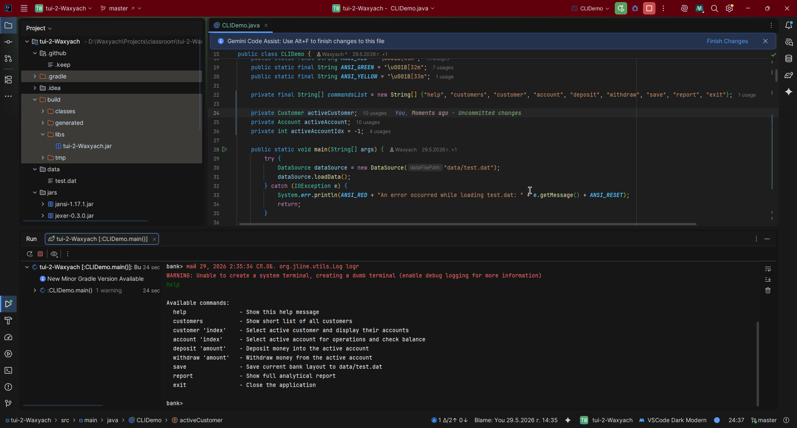

# UI Lab 2: Консольний інтерфейс користувача (CLI) з використанням JLine 3

Цей репозиторій містить виконання лабораторної роботи з розробки інтерактивного інтерфейсу командного рядка (CLI) для банківської системи за допомогою бібліотек **JLine 3** та **JAnsi**. Проєкт інтегровано з класами `Bank`, `Customer`, `Account` тощо.

---

## Реалізований функціонал

Код базового шаблону програми `CLIDemo` було повністю рефакторизовано, розділено на логічні методи згідно з принципом єдиної відповідальності (Single Responsibility) та доповнено до максимального рівня (завдання на "5+"):

1. **Динамічне завантаження даних (на "4"):** Дані про клієнтів автоматично зчитуються з файлу `data/test.dat` за допомогою класу `DataSource`.
2. **Інтерактивне автодоповнення (Completer):** Налаштовано `StringsCompleter` для підтримки повного списку команд. При натисканні клавіші `TAB` термінал пропонує доступні варіанти або автоматично дописує команди.
3. **Генерація аналітичних звітів (на "5"):** Додано команду `report`, яка виводить детальний звіт у стилі `CustomerReport` з повним переліком клієнтів та всіх їхніх рахунків.
4. **Концепція стану сесії (Stateful CLI):** Реалізовано команди з аргументами, які дозволяють зафіксувати активного клієнта та його рахунок у поточному сеансі:
    * `customer 'index'` — вибір активного клієнта за його ID та відображення списку його рахунків.
    * `account 'index'` — вибір конкретного рахунку клієнта та перегляд його поточного балансу.
5. **Проведення транзакцій:** Додано команди `deposit 'amount'` та `withdraw 'amount'` для інтерактивного поповнення або зняття коштів з обраного рахунку з обробкою бізнес-логіки банку (`OverDraftAmountException`).
6. **Збереження стану банку:** Реалізовано команду `save`, яка записує всі внесені під час сесії зміни (нові баланси, транзакції) назад у файл `data/test.dat` зі збереженням початкової структури файлу.

---

## Скріншот роботи програми

Нижче продемонстровано інтерактивну роботу CLI-клієнта у системному терміналі, відображення динамічного prompt-запрошення `bank (Soley:1)>`, процес автодоповнення та виведення аналітичного звіту:

